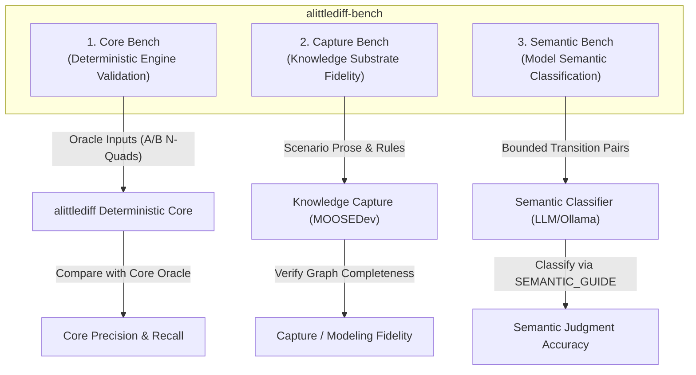

# `alittlediff-bench`: Benchmark Suite Specification

`alittlediff-bench` is a public, synthetic, reproducible benchmark suite for evaluating epistemic diffing engines, knowledge graph extraction pipelines, and model-assisted semantic change classifiers.

---

## 1. Benchmark Architecture: The Three Sub-Benches



### 1. Core Bench (Deterministic Engine)
* **Scope:** Verifies that given fixed Epistemic State A and Epistemic State B, `alittlediff` deterministically produces the exact expected structural changes, lifecycle supersessions, and causal impact traversals.
* **Pass Criterion:** Strict equality against `core_expected` fields (`structural_type`, `expected_impacts`, `expected_non_impacts`).
* **Requirements:** Local, deterministic, 0 LLM calls, zero external daemon dependencies.
* **Multi-Hop Traversal Scope:** V0 multi-hop propagation is conservative and validated against canonical scenario `22_two_hop_reverse_chain` for supported two-hop reverse-chain behavior; the independent BFS reference evaluator is differentially validated at depth 1.

### 2. Capture Bench (Substrate Modeling Quality)
* **Scope:** Tests whether the knowledge substrate (e.g. MOOSEDev) successfully captures the necessary causal topology from real development events.
* **Separation of Concerns:** Isolates whether an error was caused by a diff engine bug or by an incomplete/overcompressed knowledge graph representation (`CAPTURE / MODELING ERROR`).

### 3. Semantic Bench (Semantic Change Classification)
* **Scope:** Benchmarks local models (e.g. `qwen3:8b`, `qwen3:14b`) and heuristics against a manually labeled ground-truth dataset of before/after transition pairs.
* **Ground Truth:** Defined by [`docs/SEMANTIC_GUIDE.md`](SEMANTIC_GUIDE.md).
* **Note:** `semantic_type` in current manifests is ground-truth annotation for the future Semantic Bench and is not part of the current Core Bench pass criterion.

---

## 2. Benchmark Case Manifest Schema

Each benchmark scenario is defined by a self-contained JSON manifest:

```json
{
  "id": "02_workflow_confirmation_refinement",
  "name": "Automated Workflow Confirmation Precondition",
  "category": "refinement",
  "description": "An automated state transition acquires a mandatory user confirmation precondition.",
  "state_a_nquads": "<urn:rec:req:1> ...",
  "state_b_nquads": "<urn:rec:req:1> ...",
  "expected_changes": [
    {
      "structural_type": "superseded",
      "semantic_type": "refinement",
      "note": "structural_type is verified by Core Bench; semantic_type is ground truth for Semantic Bench."
    }
  ],
  "expected_impacts": [
    {
      "target_id": "urn:rec:dec:transition",
      "effect": "justification_may_have_changed",
      "confidence": "high",
      "predicate": "isMotivatedBy"
    }
  ],
  "expected_non_impacts": [
    "urn:rec:con:unrelated_policy"
  ],
  "metamorphic_invariants": [
    "line_order_permutation",
    "unrelated_substrate_isolation",
    "inverse_relation_equivalence"
  ]
}
```

---

## 3. The 10 Canonical Core Bench Scenarios

| ID | Title | Semantic Category | Invariant & Oracle Description |
|---|---|---|---|
| `01_exact_noop` | Exact Semantic No-Op | `semantic_noop` | $A \rightarrow A$ exact identity: 0 changes, 0 impacts. |
| `02_workflow_confirmation_refinement` | Precondition Addition | `refinement` | Automated state transition acquires user confirmation guard; flags downstream state transition via `isMotivatedBy`. |
| `03_constraint_refinement` | Invariant Narrowing | `refinement` | Constraint update governing architectural decisions; flags governed decision via `constrains`. |
| `04_operational_consequence` | Worker Redesign Consequence | `revision` | Decision to replace sync worker with async Redis queue flags latency consequence via `resultsIn`. |
| `05_empirical_lesson_invalidation` | Empirical Lesson Invalidation | `revision` | Decision update modifying coordinate alignment prompts review of lesson via `learnedFrom`. |
| `06_inverse_relation_equivalence` | Direct / Inverse Equivalence | `refinement` | Forward `constrains` and inverse `isConstrainedBy` produce identical target impacts and confidence. |
| `07_unrelated_substrate_isolation` | Substrate Noise Isolation | `semantic_noop` | Adding unrelated `CodeEntity` triples must not alter the primary architectural change set or downstream impact set. |
| `08_negative_decision_isolation` | Negative Traversal Boundary | `refinement` | Modifying a decision governed by a constraint strictly does not back-propagate to invalidate the constraint. |
| `09_support_degraded` | Multi-Premise Partial Loss | `refinement` | **Current V0:** flags target via `justification_may_have_changed`.<br/>**Future Target (V1):** `support_degraded` (*1 of 2 explicit supports remains*). |
| `10_retired_target_suppression` | Retracted Entity Protection | `semantic_noop` | Upstream premise change pointing to already retracted target is suppressed from active alerts. |

---

## 4. Evaluation Failure Diagnostic Taxonomy

When diagnosing discrepancies during benchmarking or live project trials, failures are classified across the entire pipeline:

```text
               DIAGNOSTIC FAILURE TAXONOMY

   1. CAPTURE / MODELING ERROR ──► Substrate omitted essential causal link or premise
   2. ADAPTER ERROR           ──► RDF parser dropped named graph or property
   3. STRUCTURAL DIFF ERROR   ──► Failed to collapse lifecycle supersession
   4. IMPACT ENGINE ERROR     ──► Policy rule traversed wrong direction or depth
   5. SEMANTIC ERROR          ──► Classifier confused refinement with belief revision
   6. PRESENTATION ERROR      ──► Output noisy or failed to group low-confidence links
```

---

## 5. Instant Scenario Materialization

Any benchmark scenario can be materialized into a clean, reproducible Git repository in 1 second using the helper script:

```bash
python benchmarks/materialize.py 02_workflow_confirmation_refinement
```
