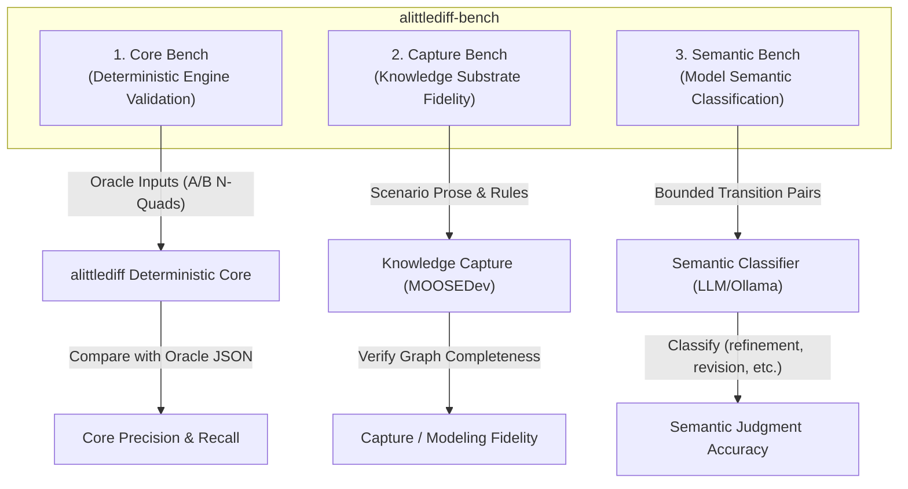

# `alittlediff-bench`: Benchmark Suite Specification

`alittlediff-bench` is a public, synthetic, reproducible benchmark suite for evaluating epistemic diffing engines, knowledge graph extraction pipelines, and model-assisted semantic change classifiers.

---

## 1. Benchmark Architecture: The Three Sub-Benches



### 1. Core Bench (Deterministic Engine)
* **Goal:** Verify that given fixed Epistemic State A and Epistemic State B, `alittlediff` deterministically produces the exact expected structural changes, lifecycle supersessions, and causal impact traversals.
* **Requirements:** Local, deterministic, zero LLM calls, zero external daemon requirements.

### 2. Capture Bench (Substrate Modeling Quality)
* **Goal:** Test whether the project knowledge substrate (e.g. MOOSEDev) successfully captures the necessary causal topology from real development events.
* **Separation of Concerns:** Distinguishes whether an erroneous conclusion was caused by a diff engine bug or by an incomplete/overcompressed knowledge graph representation.

### 3. Semantic Bench (Semantic Change Classification)
* **Goal:** Benchmark local models (e.g. `qwen3:8b`, `qwen3:14b`) and heuristics against a manually labeled ground-truth dataset of before/after transition pairs.
* **Taxonomy:** `refinement`, `world_update`, `belief_revision`, `expansion`, `contraction`, `contradiction`, `semantic_noop`, `unclear`.

---

## 2. Benchmark Case Manifest Schema

Each benchmark scenario is defined by a self-contained JSON manifest:

```json
{
  "id": "workflow_confirmation_refinement",
  "name": "Automated Workflow Confirmation Precondition",
  "category": "refinement",
  "description": "An automated state transition acquires a mandatory user confirmation precondition.",
  "state_a_nquads": "<urn:rec:req:1> ...",
  "state_b_nquads": "<urn:rec:req:1> ...",
  "expected_changes": [
    {
      "change_id_pattern": ".*dec:1.*",
      "structural_type": "superseded",
      "semantic_type": "refinement"
    }
  ],
  "expected_impacts": [
    {
      "target_id": "urn:rec:dec:transition",
      "effect": "justification_may_have_changed",
      "confidence": "high",
      "predicate": "isMotivatedBy"
    }
  ],
  "expected_non_impacts": [
    "urn:rec:con:unrelated_policy"
  ],
  "metamorphic_invariants": [
    "line_order_permutation",
    "unrelated_substrate_isolation",
    "inverse_relation_equivalence"
  ]
}
```

---

## 3. The 10 Canonical Core Bench Scenarios

| ID | Title | Core Invariant Tested | Expected Output |
|---|---|---|---|
| `01_exact_noop` | Exact State Identity | $A \rightarrow A$ exact identity | 0 changes, 0 impacts |
| `02_workflow_confirmation_refinement` | Precondition Addition | Structural supersession which is semantically a refinement | 1 supersession; flags downstream decision via `isMotivatedBy` |
| `03_constraint_refinement` | Invariant Narrowing | Constraint update governing architectural decisions | 1 supersession; flags governed decision via `constrains` |
| `04_operational_consequence` | Downstream Consequence | Decision change affecting operational costs | 1 change; flags operational consequence via `resultsIn` |
| `05_empirical_lesson_invalidation` | Empirical Lesson Invalidation | Decision update modifying an empirical rule | 1 change; flags lesson via `learnedFrom` |
| `06_inverse_relation_equivalence` | Direct / Inverse Equivalence | `constrains` forward vs `isConstrainedBy` reverse | Identical target impact and effect |
| `07_unrelated_substrate_isolation` | Low-Level Code Churn | Large volume of code entities added to State B | 0 code entities in primary report |
| `08_negative_decision_isolation` | Negative Traversal Boundary | Modifying a decision governed by a constraint | Decision change does NOT back-propagate to constraint |
| `09_support_degraded` | Multi-Premise Partial Invalidation | Decision supported by Premise 1 and Premise 2; Premise 1 superseded | Target flagged; retains active Premise 2 (`SUPPORT DEGRADED` archetype) |
| `10_retired_target_suppression` | Retracted Entity Protection | Upstream premise change pointing to already retired target | Suppressed from active reconsideration alerts |

---

## 4. Evaluation Failure Diagnostic Taxonomy

When diagnosing discrepancies during benchmarking or live project trials, failures are classified across the entire pipeline:

```text
               DIAGNOSTIC FAILURE TAXONOMY

   1. CAPTURE / MODELING ERROR ──► Substrate omitted essential causal link or premise
   2. ADAPTER ERROR           ──► RDF parser dropped named graph or property
   3. STRUCTURAL DIFF ERROR   ──► Failed to collapse lifecycle supersession
   4. IMPACT ENGINE ERROR     ──► Policy rule traversed wrong direction or depth
   5. SEMANTIC ERROR          ──► Classifier confused refinement with belief revision
   6. PRESENTATION ERROR      ──► Output noisy or failed to group low-confidence links
```
