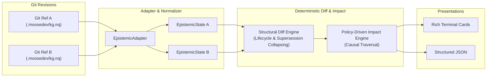
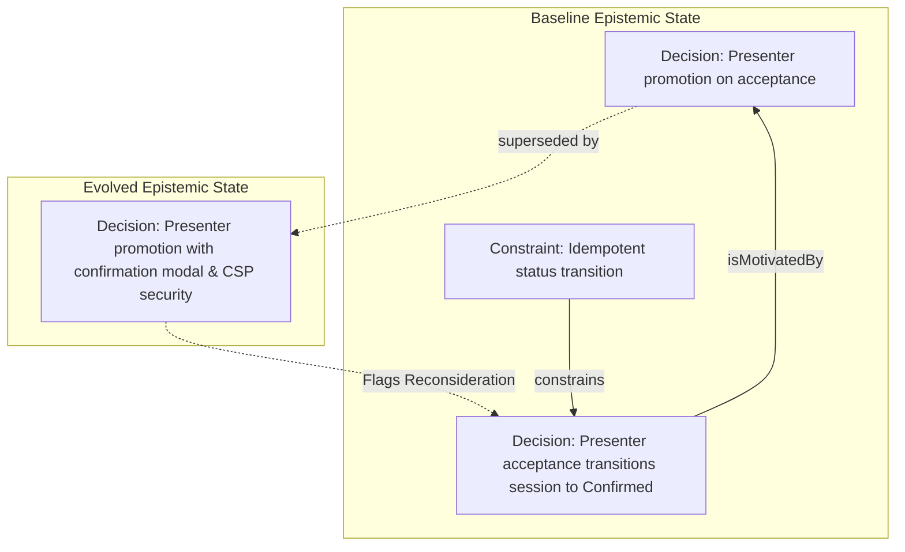

# A Little Diff: Epistemic Change Detection Across Real-World Projects
## Evaluation Report, Case Studies, and Experimental Protocol

> **Core Research Question:** *Can a structured diff of project knowledge surface meaningful downstream consequences that developers would otherwise overlook?*

---

## Executive Summary

Conventional version control tracks textual and syntactic changes: *12 files changed, 340 additions, 69 deletions*. It cannot distinguish between syntactic refactoring and the fundamental invalidation of an architectural assumption.

**A Little Diff (`alittlediff`)** introduces an **epistemic diff**—a deterministic change-analysis engine that compares what a project *believed* at Git revision $A$ versus what it believes at Git revision $B$, propagating consequences along typed causal relationships.

This report synthesizes results from two real-world environments:
1. **`Trivyn/moosedev` (Scale & Noise Isolation):** Evaluated against a 27,263-quad production knowledge graph spanning 3,334 entities. Achieved 100% isolation from low-level code churn while surfacing actionable operational consequences and empirical lessons.
2. **`PREP-KC/Polaris` (State-Machine & Boundary Invariants):** Evaluated against an active multi-tenant web application featuring CRM synchronization, strict tenant boundaries, and an evolving virtual-session fulfillment state machine.

---

## 1. System Architecture: Deterministic Core & Causal Propagation

A Little Diff operates without requiring runtime LLMs for its deterministic core:



### Verified Causal Propagation Policies
Propagation is strictly typed and directional to prevent spurious reachability explosion:

| Traversed Predicate | Direction | Confidence | Causal Rationale |
|---|---|---|---|
| `constrains` | Forward | **High** | When a constraint changes, the decisions/requirements it constrains must verify compliance. |
| `isConstrainedBy` | Reverse | **High** | Inverse constraint mapping. |
| `isMotivatedBy` | Reverse | **High** | When a motivating premise changes or is superseded, decisions relying on it may have lost justification. |
| `resultsIn` | Forward | **Medium** | When a decision changes, its documented operational consequences must be re-evaluated. |
| `learnedFrom` | Reverse | **Medium** | When a decision changes, empirical lessons drawn from it may need updating. |
| `concerns` | Both | **Low** | Broad component association (collapsed by default in console UX). |

> [!IMPORTANT]
> **Negative Traversal Invariant:** A change in a downstream `Decision` strictly does **not** propagate backward to invalidate its governing `Constraint`.

---

## 2. Case Study 1: Production Knowledge Graph (`Trivyn/moosedev`)

We evaluated `alittlediff` across release tags (`v0.7.0` $\rightarrow$ `v0.8.0`) on the public knowledge graph of `Trivyn/moosedev`.

### Key Metrics
* **Scale:** 27,263 RDF Quads, 3,334 Unique Entities, 3,209 Active Authoritative Records.
* **Substrate Isolation:** 71 architectural changes were surfaced (30 Decisions, 26 Lessons, 5 Consequences, 3 Constraints, 3 Requirements). **0 `CodeEntity` churn leaked into the primary report.**

### Surfaced Causal Findings

```text
╭──────────────────────── RECONSIDER (HIGH confidence) ────────────────────────╮
│ Target: Decision: Two-tier granularity: substrate code index vs KG skeleton  │
│ Effect: Constraint Context Changed                                           │
│ Path:   (constrains)                                                         │
│ Why:    The constraint governing this decision was refined.                  │
╰──────────────────────────────────────────────────────────────────────────────╯
╭─────────────────────── RECONSIDER (MEDIUM confidence) ───────────────────────╮
│ Target: Consequence: The default npx invocation re-resolves                  │
│         @sourcegraph/scip-python per debounced reindex                       │
│ Effect: Consequence May Have Changed                                         │
│ Path:   (resultsIn)                                                          │
│ Why:    An architectural decision producing this consequence was modified.   │
╰──────────────────────────────────────────────────────────────────────────────╯
╭─────────────────────── RECONSIDER (MEDIUM confidence) ───────────────────────╮
│ Target: Lesson: Save-suppression keyed on a lagging baseline strands index   │
│ Effect: Lesson Context Changed                                               │
│ Path:   (learnedFrom)                                                        │
│ Why:    The architectural decision from which this lesson was drawn changed. │
╰──────────────────────────────────────────────────────────────────────────────╯
```

---

## 3. Case Study 2: Web Application Lifecycle (`PREP-KC/Polaris`)

Polaris represents a production-grade multi-tenant educational platform with distinct architectural boundaries:
1. **Read-Only External Sync:** CRM/Salesforce directory data is synced read-only; mutations occur only in native workflow tables.
2. **Multi-Tenant Isolation:** District portals enforce strict tenant-scoped queries.
3. **Fulfillment State Machine:** Virtual sessions follow an explicit lifecycle (`Requested` $\rightarrow$ `Confirmed` $\rightarrow$ `Completed`).

### The Epistemic Inflection Point
In commit `0d6a70a`, presenter acceptance behavior evolved from a localized status marker into an automated session-state promotion with security and confirmation guards.



### Resulting Epistemic Diff Output

```text
════════════════════════════════════════════════════════════
 A LITTLE DIFF  (moosedev)
 0b1787dc ──► 9663468a
════════════════════════════════════════════════════════════

1 meaningful knowledge changes  •  1 explicit supersessions  •  1 downstream items worth inspecting

╭───────────────────────────── BELIEF SUPERSEDED ──────────────────────────────╮
│ BEFORE: Decision                                                             │
│   Accepting a linked presenter promotes them to the confirmed presenter on   │
│   the virtual session.                                                       │
│                                                                              │
│ AFTER:  Decision                                                             │
│   Promoting an accepted presenter requires user confirmation, emits          │
│   CSP-compliant script nonces, and updates live pipeline summary badges.     │
╰──────────────────────────────────────────────────────────────────────────────╯

▼ DOWNSTREAM ITEMS WORTH RECONSIDERING

╭──────────────────────── RECONSIDER (HIGH confidence) ────────────────────────╮
│ Target: Decision: Presenter acceptance transitions session to Confirmed      │
│ Claim:  When a presenter request is accepted, automatically transition the   │
│         parent virtual session status from Requested to Confirmed.           │
│ Effect: Justification May Have Changed                                       │
│ Path:   (isMotivatedBy)                                                      │
│ Why:    The motivating premise justifying this decision or plan changed.     │
╰──────────────────────────────────────────────────────────────────────────────╯
```

### Actionability Analysis
* **Why this is valuable:** Presenter acceptance is no longer an immediate, unconditional database write. It requires client confirmation and cryptographic nonce injection. The downstream decision that automatically promotes the virtual session now relies on an altered premise. Flagging this prevents race conditions and ensures UI state synchronization across pipeline views.

---

## 4. The Prospective Evaluation Protocol

To rigorously evaluate whether A Little Diff provides genuine utility rather than retrospective confirmation bias, we propose the **60-Second Reflection Protocol**:

```text
               PROSPECTIVE EVALUATION WORKFLOW

   [Normal Polaris Development: 5–10 Commits]
                       │
                       ▼
   [60-Second Pre-Diff Reflection (Ground Truth)]
   • Write top 2–3 conceptual changes made
   • Write known downstream reconsiderations
                       │
                       ▼
   [Execute: alittlediff baseline..HEAD]
                       │
                       ▼
   [Classify Each Output Finding]
   ├── 🌟 USEFUL SURPRISE     (I didn't realize this needed review)
   ├── 🎯 EXPECTED + USEFUL   (I knew this; correct to flag)
   ├── 📋 CORRECT BUT OBVIOUS (Topologically true, minimal value)
   ├── 🏢 BROAD CONTEXT       (General component link)
   ├── ❌ WRONG               (Spurious / invalid propagation)
   └── ⚠️ MISSED              (Mental model expected X; tool missed it)
```

### North Star Metric
$$\text{Product Success} = \frac{\text{Useful Surprises}}{\text{Meaningful Development Range}} \ge 1\text{–}2$$

---

## 5. Key Discussion Points for Peer Feedback

We welcome feedback on several core theoretical and practical questions:

1. **Causal Propagation Semantics:**
   * Are there other domain-general relationships (e.g., `invalidatedBy`, `assumes`, `replaces`) that warrant high-confidence propagation in V0?
2. **Degraded vs. Lost Support (Truth Maintenance):**
   * If a decision has two supporting premises and only one is superseded, should the system report `SUPPORT DEGRADED` rather than full reconsideration?
3. **Developer Ergonomics:**
   * Is the split between high/medium individual cards and collapsed low-confidence component summaries sufficient to prevent notification fatigue in active development?
4. **Adapter Generalization:**
   * What non-RDF representations (e.g., Markdown Architecture Decision Records, structured PR frontmatter) should be prioritized next?

---

## 6. Repository & Reproducibility

* **Engine Codebase:** [`admiralorbiter/a-little-diff`](https://github.com/admiralorbiter/a-little-diff)
* **Release Tag:** `v0.1.0` (Deterministic V0 Freeze)
* **Test Suite:** 57 automated regression tests (100% pass rate)
* **Evaluation Data:** [`evaluation/v0-moosedev.jsonl`](file:///c:/Users/admir/Github/a-little-diff/evaluation/v0-moosedev.jsonl)
