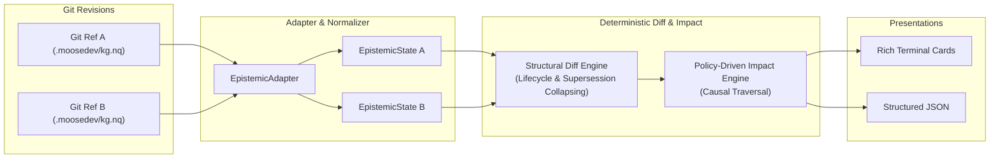
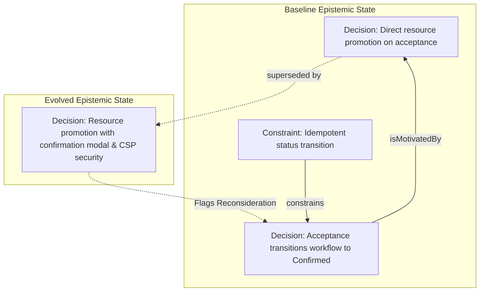

# Epistemic Change Detection Across Real-World Projects
## Retrospective Calibration Report, Methodological Findings, and Benchmark Strategy

> **Core Research Question:** *Can a structured diff of project knowledge surface meaningful downstream consequences that developers would otherwise overlook?*

---

## Executive Summary

Conventional version control tracks textual and syntactic changes: *12 files changed, 340 additions, 69 deletions*. It cannot distinguish between routine syntactic refactoring and the fundamental invalidation of an architectural assumption.

**A Little Diff (`alittlediff`)** introduces an **epistemic diff**—a deterministic change-analysis engine that compares what a project *believed* at Git revision $A$ versus what it believes at Git revision $B$, propagating consequences along typed causal relationships.

This report synthesizes empirical findings across two evaluation environments:
1. **Large-Scale Production Knowledge Graph (`Trivyn/moosedev`):** Evaluated against a 27,263-quad production knowledge graph spanning 3,334 entities. In the evaluated range, no `CodeEntity` records appeared among the 71 reported architectural changes, while actionable operational consequences and empirical lessons were surfaced.
2. **Private Application Retrospective Calibration:** Evaluated against an active multi-tenant web application featuring external directory synchronization, strict tenant boundaries, and an evolving automated workflow fulfillment state machine.

### The Core Methodological Discovery
A key finding emerged from the private application calibration: **a graph lifecycle event marked as `superseded` can semantically represent a `refinement`.**

Specifically, when an automated state transition acquired an explicit user-confirmation precondition and cryptographic nonce guards, the underlying knowledge substrate recorded the earlier decision as `superseded` by the new decision. Mechanically, the graph link was superseded; semantically, the core architectural intent was preserved and tightened.

This demonstrates the foundational architecture principle of A Little Diff:
> **Models interpret; code maintains truth.**  
> Graph-level lifecycle bookkeeping (`structural_type = superseded`) must remain strictly decoupled from semantic interpretation (`semantic_type = refinement`).

To ensure full reproducibility without exposing proprietary application details, this private calibration episode was generalized into the canonical public benchmark scenario: [`02_workflow_confirmation_refinement.json`](../benchmarks/manifests/02_workflow_confirmation_refinement.json).

---

## 1. System Architecture: Deterministic Core & Causal Propagation

A Little Diff operates without requiring runtime LLMs for its deterministic core:



### Verified Causal Propagation Policies
Propagation is strictly typed and directional to prevent spurious reachability explosion:

| Traversed Predicate | Direction | Confidence | Causal Rationale |
|---|---|---|---|
| `constrains` | Forward | **High** | When a constraint changes, the decisions/requirements it constrains must verify compliance. |
| `isConstrainedBy` | Reverse | **High** | Inverse constraint mapping. |
| `isMotivatedBy` | Reverse | **High** | When a motivating premise changes or is superseded, decisions relying on it may have lost justification. |
| `resultsIn` | Forward | **Medium** | When a decision changes, its documented operational consequences must be re-evaluated. |
| `learnedFrom` | Reverse | **Medium** | When a decision changes, empirical lessons drawn from it may need updating. |
| `concerns` | Both | **Low** | Broad component association (collapsed by default in console UX). |

> [!IMPORTANT]
> **Negative Traversal Invariant:** A change in a downstream `Decision` strictly does **not** propagate backward to invalidate its governing `Constraint`.

---

## 2. Trial 1: Production Knowledge Graph (`Trivyn/moosedev`)

We evaluated `alittlediff` across release tags (`v0.7.0` $\rightarrow$ `v0.8.0`) on the public knowledge graph of `Trivyn/moosedev`.

### Key Metrics
* **Scale:** 27,263 RDF Quads, 3,334 Unique Entities, 3,209 Active Authoritative Records.
* **Substrate Isolation:** 71 architectural changes were surfaced (30 Decisions, 26 Lessons, 5 Consequences, 3 Constraints, 3 Requirements). In the evaluated range, no `CodeEntity` records appeared among the 71 reported architectural changes.

### Surfaced Causal Findings

```text
╭──────────────────────── RECONSIDER (HIGH confidence) ────────────────────────╮
│ Target: Decision: Two-tier granularity: substrate code index vs KG skeleton  │
│ Effect: Constraint Context Changed                                           │
│ Path:   (constrains)                                                         │
│ Why:    The constraint governing this decision was refined.                  │
╰──────────────────────────────────────────────────────────────────────────────╯
╭─────────────────────── RECONSIDER (MEDIUM confidence) ───────────────────────╮
│ Target: Consequence: The default npx invocation re-resolves                  │
│         @sourcegraph/scip-python per debounced reindex                       │
│ Effect: Consequence May Have Changed                                         │
│ Path:   (resultsIn)                                                          │
│ Why:    An architectural decision producing this consequence was modified.   │
╰──────────────────────────────────────────────────────────────────────────────╯
╭─────────────────────── RECONSIDER (MEDIUM confidence) ───────────────────────╮
│ Target: Lesson: Save-suppression keyed on a lagging baseline strands index   │
│ Effect: Lesson Context Changed                                               │
│ Path:   (learnedFrom)                                                        │
│ Why:    The architectural decision from which this lesson was drawn changed. │
╰──────────────────────────────────────────────────────────────────────────────╯
```

---

## 3. Trial 2: Private Application Retrospective Calibration

To test how A Little Diff handles multi-tier business applications, we calibrated the engine against canonical architectural patterns from an active production web application:
1. **Read-Only External Sync Mirror:** External directory synchronization is strictly read-only; mutations occur only in native workflow tables.
2. **Multi-Tenant Isolation Boundary:** Tenant-scoped portals enforce strict query filters.
3. **Automated State Machine Fulfillment:** Workflow objects follow an explicit lifecycle (`Pending` $\rightarrow$ `Confirmed` $\rightarrow$ `Completed`).

### The Scenario: Workflow Refinement
In an active development cycle, the workflow assignment behavior evolved:
* **Baseline:** An unconfirmed resource acceptance immediately and unconditionally transitioned the parent workflow object state from `Pending` to `Confirmed`.
* **Revision:** Resource promotion was hardened to require explicit user confirmation, emit cryptographic script nonces, and dynamically synchronize pipeline summary metrics.



### Reproducing this Pattern
This exact causal structure is codified as public benchmark scenario [`02_workflow_confirmation_refinement`](../benchmarks/manifests/02_workflow_confirmation_refinement.json). Running A Little Diff on this scenario yields:

```text
1 meaningful knowledge changes  •  1 explicit supersessions  •  1 downstream items worth inspecting

╭───────────────────────────── RECORD SUPERSEDED ──────────────────────────────╮
│ BEFORE: Decision                                                             │
│   Automatic resource assignment                                              │
│                                                                              │
│ AFTER:  Decision                                                             │
│   Confirmed resource assignment with UI guard                                │
╰──────────────────────────────────────────────────────────────────────────────╯

▼ DOWNSTREAM ITEMS WORTH RECONSIDERING

╭──────────────────────── RECONSIDER (HIGH confidence) ────────────────────────╮
│ Target: Decision: Automatic session promotion                                │
│ Effect: Justification May Have Changed                                       │
│ Path:   (isMotivatedBy)                                                      │
│ Why:    The motivating premise justifying this decision or plan changed.     │
╰──────────────────────────────────────────────────────────────────────────────╯
```

### Analytical Takeaways
1. **Correct Causal Identification:** Changing the preconditions of resource promotion correctly alerted the downstream automatic state transition via `isMotivatedBy`.
2. **Structural vs. Semantic Decoupling:** The deterministic diff correctly identified `structural_type: superseded`, while the semantic ground truth is `semantic_type: refinement`.

---

## 4. The Prospective Evaluation Protocol

To prevent retrospective confirmation bias, live project trials follow the **60-Second Pre-Diff Reflection Protocol**:

```text
               PROSPECTIVE EVALUATION WORKFLOW

   [Normal Development Range: 5–10 Commits]
                       │
                       ▼
   [60-Second Pre-Diff Reflection (Ground Truth)]
   • Write top 2–3 conceptual changes made
   • Write known downstream reconsiderations
                       │
                       ▼
   [Execute: alittlediff baseline..HEAD]
                       │
                       ▼
   [Classify Each Output Finding]
   ├── 🌟 USEFUL SURPRISE     (I didn't realize this needed review)
   ├── 🎯 EXPECTED + USEFUL   (I knew this; correct to flag)
   ├── 📋 CORRECT BUT OBVIOUS (Topologically true, minimal value)
   ├── 🏢 BROAD CONTEXT       (General component link)
   ├── ❌ WRONG               (Spurious / invalid propagation)
   ├── ⚠️ MISSED              (Mental model expected X; tool missed it)
   └── 🔍 CAPTURE ERROR       (Substrate modeling omission/flaw)
```

### North Star Metric
$$\text{Product Success} = \frac{\text{Useful Surprises}}{\text{Meaningful Development Range}} \ge 1\text{–}2$$

---

## 5. Next Phase: Public Benchmark (`alittlediff-bench`)

Rather than exposing private codebases, real architectural scenarios are mined and codified into a public, reproducible benchmark suite:

1. **Core Bench:** Deterministic input/oracle diff validation without LLMs or external runtimes.
2. **Capture Bench:** Evaluating knowledge extraction fidelity against scenario specifications to isolate capture errors.
3. **Semantic Bench:** Ground-truth classification dataset for local models (e.g. `qwen3:8b`, `qwen3:14b`) classifying semantic change types.
4. **Metamorphic Invariant Suite:** Property-based testing generating hundreds of invariant preserving graph permutations.

---

## 6. Repository & Reproducibility

* **Engine Codebase:** [A Little Diff](https://github.com/admiralorbiter/a-little-diff)
* **Release Tag:** `v0.1.0` (Deterministic V0 Freeze)
* **Benchmark Specification:** [`docs/BENCHMARK.md`](BENCHMARK.md)
* **Semantic Annotation Guide:** [`docs/SEMANTIC_GUIDE.md`](SEMANTIC_GUIDE.md)
* **Evaluation Data:** [`evaluation/v0-moosedev.jsonl`](../evaluation/v0-moosedev.jsonl)
